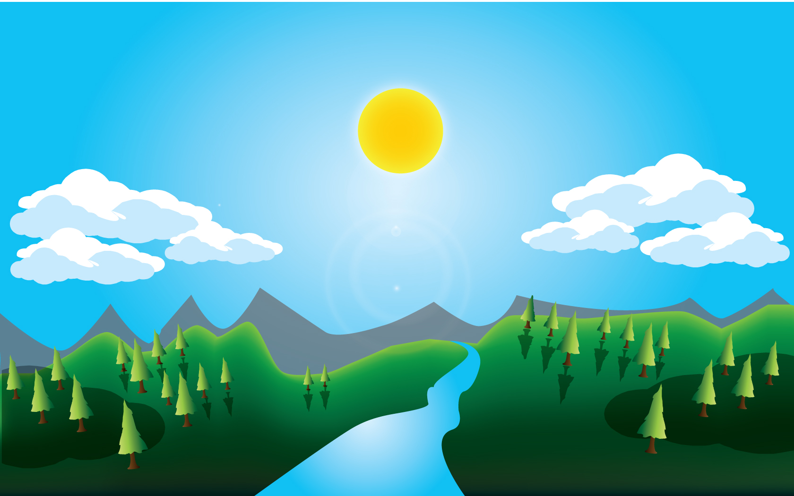

# Kitten
ESte proyecto tiene como reto hacer que la imagen de fondo y la imgen del gato cambie cuando el usuario modifique el tamaño de la ventana del navegador.

## Objetivo
+ Que podamos utilizar los `@medias queries` en este reto.
+ El poder definir como logar el efecto deseado.
+ Trabajar con `CSS`.

## Encontrarás 
+ Una carpeta `assets` en donde encontrarás la distintas imagenes a utilizar.
+ Una carpeta `CSS`
+ Un archivo `index.html`.

 

